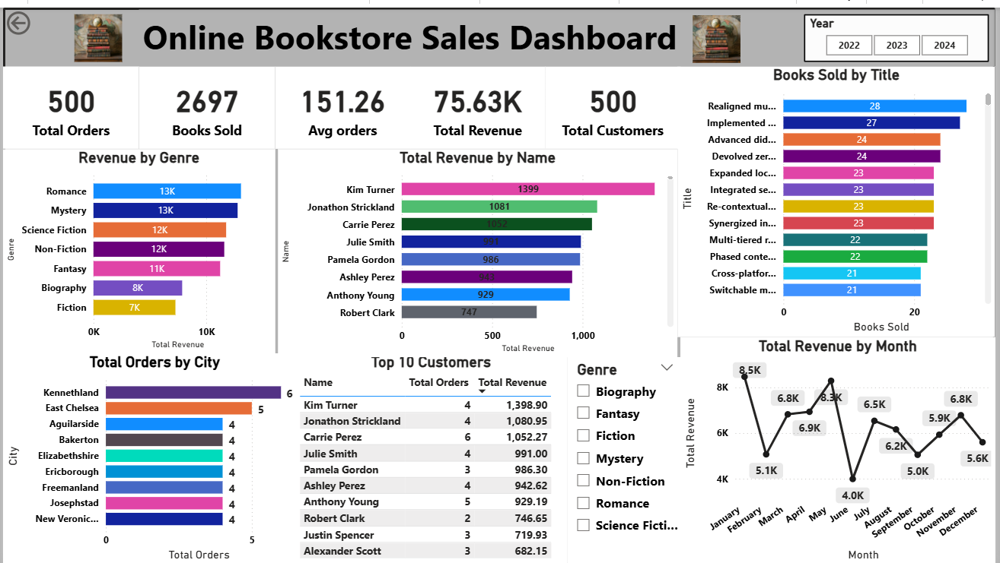

# 📊 Online Bookstore Sales Analysis | SQL + Power BI

This project analyzes **online bookstore sales data** using **SQL for data analysis** and **Power BI for interactive data visualization**.
The goal of the project is to explore customer purchasing behavior, revenue trends, and book performance to generate meaningful business insights.

---

## 🚀 Project Overview

The project combines **SQL querying and Power BI dashboarding** to analyze bookstore sales data. SQL is used to perform data exploration and business analysis, while Power BI is used to create an **interactive dashboard** that presents key insights visually.

---

## 🛠 Skills & Tools Used

* **SQL (MySQL)** – Data querying and analysis
* **Power BI** – Dashboard creation and data visualization
* **DAX** – Creating calculated measures and KPIs
* **Data Modeling** – Connecting tables for analysis
* **Data Visualization** – Creating business insights through charts
* **Data Analysis** – Identifying patterns and trends

---

## 📁 Project Files

* `Books.csv` – Book details dataset
* `Customers.csv` – Customer information dataset
* `Orders (1).csv` – Orders and transaction dataset
* `Online_Bookstore_Analysis.sql` – SQL queries used for analysis
* `Online_Bookstore_Analysis_Dashboard.pbix` – Power BI dashboard file
* `online_bookstore.png` – Dashboard preview image

---

## 📊 Dashboard Features

The Power BI dashboard includes:

* **Total Orders**
* **Total Revenue**
* **Total Customers**
* **Books Sold**
* **Average Order Value**
* **Revenue by Genre**
* **Top Customers by Revenue**
* **Books Sold by Title**
* **City-wise Order Distribution**
* **Monthly Revenue Trend**

It also includes **interactive slicers** that allow users to filter data by **Genre and Year**.

---

## 📈 Key Insights

* Identifies the **top-performing book genres**
* Shows **revenue trends across months**
* Highlights **top customers contributing to revenue**
* Analyzes **city-wise distribution of orders**
* Tracks **best-selling books**

---

## 📷 Dashboard Preview

---

## 🎯 Project Objective

The objective of this project is to demonstrate **data analysis and visualization skills using SQL and Power BI**, and to transform raw sales data into actionable business insights.

---

## ⭐ Future Improvements

* Add advanced SQL queries (Window Functions, CTEs)
* Enhance dashboard with additional KPIs
* Implement dynamic Top-N analysis
* Add more advanced Power BI visualizations

---

## 👨‍💻 Author

**Chandan Sah**

Data Analyst | SQL | Power BI | Data Visualization
